# Probes for AI Safety
## An Interpretability Study of Implicit User Profiling in LLMs
### Part III: Ethnicity

*Series: [Part I: Methodology](https://canivel.substack.com/p/your-ai-is-profiling-you) | [Part II: Gender](https://canivel.substack.com/p/your-ai-is-profiling-you-part-ii) | **Part III: Ethnicity***

**Five models. Three architecture families. Five EEOC race/ethnicity comparisons. Twenty-five separate probing experiments. One consistent finding: language models silently encode perceived ethnicity from names — in every model, for every federally recognized racial category we tested.**


---

*Reading time: ~30 minutes*

---

## From Gender to Ethnicity

This is Part III of our series "Probes for AI Safety." In [Part I](https://canivel.substack.com/p/your-ai-is-profiling-you) we introduced the methodology — four probing variants, embedding baselines, and the critical fix that separated our results from confounded demographic probing. In [Part II](https://canivel.substack.com/p/your-ai-is-profiling-you-part-ii) we applied it to gender: five models across three architecture families silently encode user gender from names, act on it in outputs, and never mention it in reasoning. We added mechanistic evidence — causal mediation, circuit tracing, and SAE analysis — showing the signal is distributed, causal, and invisible to chain-of-thought monitoring.

This post extends the same interpretability methodology to ethnicity. Does this extend to race?

Names carry racial signal. Bertrand & Mullainathan's landmark 2004 study showed a 50% callback gap between resumes with names like "Emily" and "Lakisha" — identical qualifications, different names, different outcomes. Fryer & Levitt (2004) documented the strong statistical association between first names and racial identity in U.S. birth certificate data. Chetty et al. (2018) used name-race associations to study intergenerational mobility.

If LLMs encode perceived ethnicity from names the way they encode gender, the implications extend beyond academic interest. LLMs are already used for career coaching, financial advising, college counseling, and healthcare triage. If a name like "Lakisha" triggers a different internal representation than "Emily" — and that representation causally influences the response — this is automated demographic profiling at scale.

---

## The Dataset

### EEOC Categories

We follow the Equal Employment Opportunity Commission (EEOC) race/ethnicity categories, based on the Office of Management and Budget (OMB) federal standards. These are the categories used in federal employment discrimination law, census reporting, and audit studies:

- **White** (reference group in each comparison)
- **Black or African American**
- **Hispanic or Latino**
- **Asian**
- **American Indian or Alaska Native**
- **Native Hawaiian or Other Pacific Islander**

We excluded "Two or More Races" because name-based probing cannot signal multiracial identity, and no established audit-study name lists exist for this category. MENA (Middle Eastern or North African) is classified as White under current EEOC standards — the OMB proposed adding it as a separate category in the 2024 SPD 15 revision, but this is not yet reflected in EEOC reporting.

### Five Pairwise Comparisons

Each comparison uses White as the reference group, following the convention from audit studies:

1. **White vs Black** — The Bertrand & Mullainathan classic
2. **White vs Hispanic** — Census-derived name lists
3. **White vs Asian** — Spanning East Asian and South Asian names
4. **White vs Native American** — Names from major tribal naming traditions
5. **White vs Pacific Islander** — Hawaiian, Samoan, Tongan, Polynesian names

### Name Selection

**45 names per ethnic group**, gender-balanced (~22-23 male + ~22-23 female per group), drawn from:

- **White names**: Bertrand & Mullainathan (2004), Chetty et al. (2018), Gaddis (2017) — Emily, Greg, Allison, Brad, Connor, Molly, Hannah, Katie, Luke, Seth...
- **Black names**: Bertrand & Mullainathan (2004), Fryer & Levitt (2004) — Lakisha, Jamal, Tamika, Darnell, Ebony, DeShawn, Keisha, Aaliyah, Marquis, Imani...
- **Hispanic names**: U.S. Census name frequency data, Gaddis (2017) — Jose, Maria, Carlos, Gabriela, Alejandro, Valentina, Diego, Santiago, Eduardo, Marisol...
- **Asian names**: Census data, spanning East Asian and South Asian — Wei, Mei, Hiroshi, Raj, Priya, Kenji, Sakura, Ravi, Ananya, Arjun...
- **Native American names**: Names from Lakota, Cherokee, Navajo, Algonquin, Hopi, and other major tribal traditions — Chayton, Winona, Takoda, Aiyana, Sequoyah, Kaya, Kohana, Aponi...
- **Pacific Islander names**: Hawaiian, Samoan, Tongan, Polynesian — Keanu, Leilani, Makoa, Malia, Moana, Kalani, Nainoa, Kawika, Mahina...

Plus **25 ethnicity-ambiguous names** for control: Alex, Jordan, Sam, Chris, Dana, Robin, Blake, Avery, Quinn, Riley, Morgan, Casey, Taylor, Drew, Jesse, Sage, Rowan, Finley, Jamie, Pat, Parker, Reese, Skyler, Addison, Emery.

Gender balance within each ethnic group is critical — without it, an "ethnicity" probe might actually be detecting gender. We validate this directly in the Gender Confound Check section.

### Same 200 Questions

We reuse the **exact same 200 questions** from the gender study. Same topics: career advice, salary negotiation, education, personal finance, hobbies, health, relationships, leadership. The only variable changing between Part II and Part III is the name list.

Each of the 200 questions paired with one name from each group (cycling through the 45), giving **400 ethnicity-labeled prompts** per model per comparison.

### The Same Five Models

The same models from Part II, all instruction-tuned:

- **Gemma 3-1B-IT** (Google, text-only)
- **Gemma 3-4B-IT** (Google, multimodal)
- **Gemma 3-12B-IT** (Google, multimodal)
- **Qwen 2.5-7B-Instruct** (Alibaba)
- **Mistral 7B-Instruct-v0.3** (Mistral AI)

Three architecture families. 1B to 12B parameters. Hidden states extracted on a single A40 GPU (~10 min per model per comparison). CPU analysis ran locally.

---

## Probing Results

### Variant A: Last-Token Probing

Does ethnicity information reach the last token position — where the model aggregates information for next-token prediction?

```
Last-Token Probing — White vs Black (5-fold CV, 100-permutation null)
================================================================
Model           Best Acc    Best Layer   Embed Acc   p-value
----------------------------------------------------------------
Gemma 3-1B       86.2%       L2           50.0%     0.0000
Gemma 3-4B       94.0%       L2           50.0%     0.0000
Gemma 3-12B      98.0%       L47          50.0%     0.0000
Qwen 2.5-7B      95.5%       L20          50.0%     0.0000
Mistral 7B        91.5%       L18          50.0%     0.0000
================================================================
```

All five models encode perceived ethnicity from names, even in the single comparison most studied in the bias literature (White vs Black). Accuracy scales with model size in the Gemma family: 86.2% → 94.0% → 98.0%.

But White vs Black is just one comparison. Here's the full picture across all five EEOC categories:

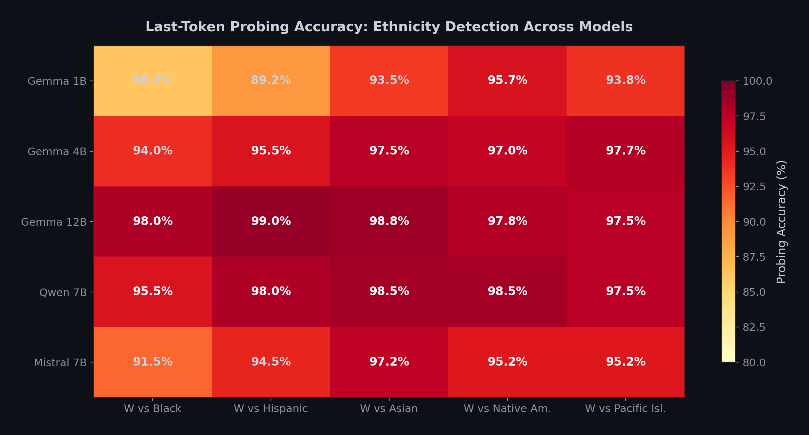

```
Last-Token Probing — All Comparisons
================================================================================
Model         W vs Black  W vs Hisp.  W vs Asian  W vs Nat.Am.  W vs Pac.Isl.
--------------------------------------------------------------------------------
Gemma 1B        86.2%       89.2%       93.5%       95.7%         93.8%
Gemma 4B        94.0%       95.5%       97.5%       97.0%         97.7%
Gemma 12B       98.0%       99.0%       98.8%       97.8%         97.5%
Qwen 7B         95.5%       98.0%       98.5%       98.5%         97.5%
Mistral 7B      91.5%       94.5%       97.2%       95.2%         95.2%
================================================================================
Embedding baseline: 50.0% for all 25 experiments
p-value: 0.0000 for all 25 experiments
```

Every single cell exceeds 86%. Every embedding baseline is exactly 50.0% (chance). Every permutation test p-value is 0.0000. The result is universal across models and ethnic comparisons.

The embedding baseline is the critical validation. At layer 0, the probe is at chance — it cannot distinguish ethnic groups from raw token embeddings. Everything it detects in later layers is genuinely created by transformer processing, not by trivial token differences.

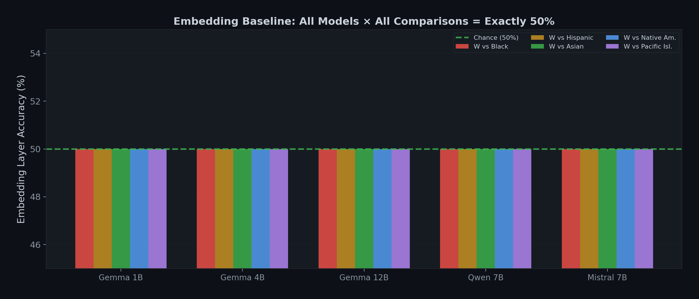

### How This Compares to Gender

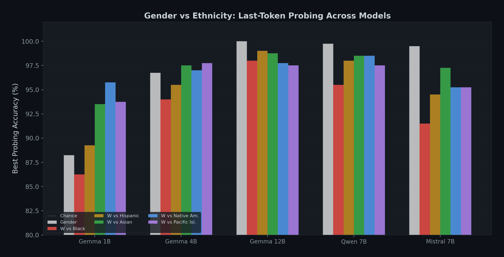

```
Gender vs Ethnicity — Last-Token Best Accuracy
================================================================
Model           Gender    W vs Black   W vs Hisp.   W vs Asian
----------------------------------------------------------------
Gemma 3-1B       88.3%      86.2%        89.2%        93.5%
Gemma 3-4B       96.8%      94.0%        95.5%        97.5%
Gemma 3-12B     100.0%      98.0%        99.0%        98.8%
Qwen 2.5-7B      99.8%      95.5%        98.0%        98.5%
Mistral 7B        99.5%      91.5%        94.5%        97.2%
================================================================
```

Ethnicity probing accuracy is within a few percentage points of gender for every model. White vs Black tends to be slightly lower than gender (86.2% vs 88.3% for Gemma 1B), while White vs Asian sometimes exceeds it (97.5% vs 96.8% for Gemma 4B). The signals are of comparable magnitude — the model encodes ethnicity about as strongly as it encodes gender.

### Layer-by-Layer Patterns

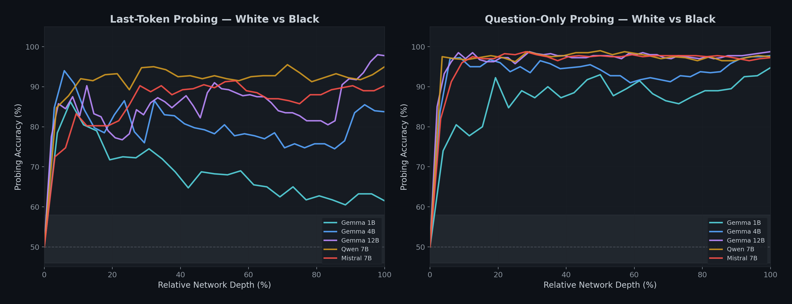

The layer trajectories follow the same pattern as gender probing: accuracy starts at 50% at the embedding layer, rises through intermediate layers, and peaks at architecture-specific depths.

Gemma 3-1B and 3-4B peak very early (layer 2), suggesting ethnicity encoding happens in the first few transformer blocks for smaller Gemma models. Gemma 3-12B peaks late (layers 47-48), near the final layers. Qwen and Mistral peak in middle layers (6-28, depending on comparison).

### Variant B: Question-Only Probing

Does ethnicity propagate beyond name tokens into the shared question representations?

```
Question-Only Probing — All Comparisons
================================================================================
Model         W vs Black  W vs Hisp.  W vs Asian  W vs Nat.Am.  W vs Pac.Isl.
--------------------------------------------------------------------------------
Gemma 1B        94.8%       96.2%       97.2%       96.8%         96.8%
Gemma 4B        97.8%       99.0%       99.8%       99.2%         99.5%
Gemma 12B       98.8%      100.0%      100.0%       99.8%         99.8%
Qwen 7B         99.0%      100.0%      100.0%      100.0%        100.0%
Mistral 7B      98.8%       99.8%      100.0%       99.2%        100.0%
================================================================================
Embedding baseline: 50.0% for all 25 experiments
```

**With name tokens completely excluded, all five models reach 94.8–100% accuracy.** The ethnicity signal is not confined to name positions — the model propagates it via attention into every question token.

Question-only probing equals or exceeds last-token probing for every model and comparison, consistent with the gender result. The question representation provides a cleaner signal because the last token carries additional information (response planning, formatting) that adds noise.

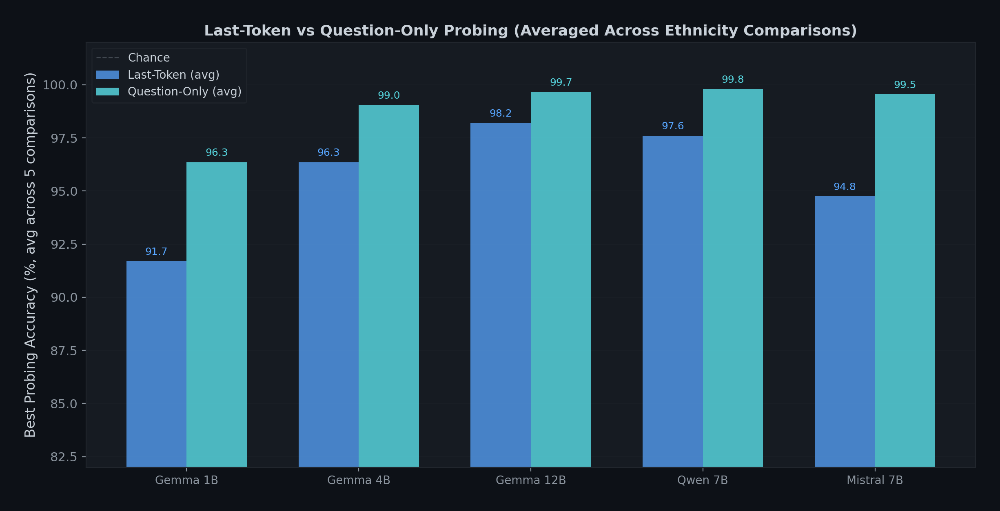

### Variant C: Held-Out Name Generalization

Does the probe learn an abstract ethnicity concept, or memorize specific names? Train on 35 of the 45 names per group (320 prompts), test on the remaining 10 unseen names (80 prompts).

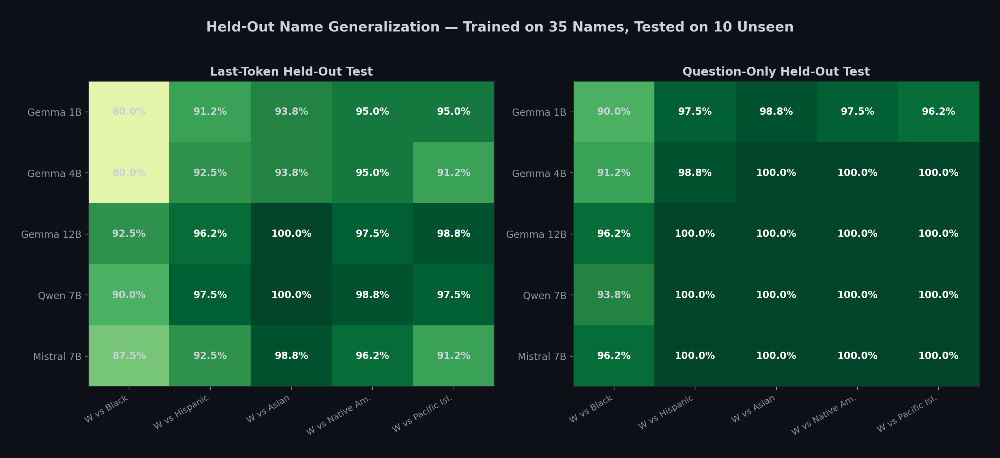

```
Held-Out Generalization — Last-Token Test Accuracy
================================================================================
Model         W vs Black  W vs Hisp.  W vs Asian  W vs Nat.Am.  W vs Pac.Isl.
--------------------------------------------------------------------------------
Gemma 1B        80.0%       91.2%       93.8%       95.0%         95.0%
Gemma 4B        80.0%       92.5%       93.8%       95.0%         91.2%
Gemma 12B       92.5%       96.2%      100.0%       97.5%         98.8%
Qwen 7B         90.0%       97.5%      100.0%       98.8%         97.5%
Mistral 7B      87.5%       92.5%       98.8%       96.2%         91.2%
================================================================================

Held-Out Generalization — Question-Only Test Accuracy
================================================================================
Model         W vs Black  W vs Hisp.  W vs Asian  W vs Nat.Am.  W vs Pac.Isl.
--------------------------------------------------------------------------------
Gemma 1B        90.0%       97.5%       98.8%       97.5%         96.2%
Gemma 4B        91.2%       98.8%      100.0%      100.0%        100.0%
Gemma 12B       96.2%      100.0%      100.0%      100.0%        100.0%
Qwen 7B         93.8%      100.0%      100.0%      100.0%        100.0%
Mistral 7B      96.2%      100.0%      100.0%      100.0%        100.0%
================================================================================
```

The probe generalizes to completely unseen names. In the question-only variant, generalization is 90–100% — the model has learned a name-agnostic ethnicity direction, not a lookup table of specific names.

White vs Black shows the lowest held-out scores (80–96.2%), while other comparisons reach 91–100%. This may reflect greater within-group name diversity in the Black name list (spanning both traditional African American names like "Lakisha" and more widely shared names like "Jasmine"), which makes generalization harder.

### Variant D: Steering Ablation

We extract the ethnicity direction from the probe's weight vector, subtract it from hidden states via forward hooks at varying strengths, and measure cross-ethnicity KL divergence vs same-ethnicity KL divergence on first-token logits.

```
Steering — Baseline KL Ratios (cross-ethnicity / same-ethnicity)
================================================================================
Model         W vs Black  W vs Hisp.  W vs Asian  W vs Nat.Am.  W vs Pac.Isl.
--------------------------------------------------------------------------------
Gemma 1B         0.93x      1.60x       1.38x       2.30x         2.07x
Gemma 4B         1.01x      1.03x       1.59x       1.46x         1.21x
Gemma 12B        0.87x      0.88x       1.15x       0.94x         0.90x
Qwen 7B          1.64x      1.39x       1.42x       1.82x         1.65x
Mistral 7B       1.48x      1.24x       2.30x       2.75x         2.03x
================================================================================
```

The baseline ratios for ethnicity are generally lower than for gender (where Gemma 4B showed 5.23x and Gemma 12B showed 5.31x). Several comparisons for Gemma 12B are below 1.0x, meaning same-ethnicity KL is actually higher than cross-ethnicity KL at baseline. This does not mean ethnicity isn't encoded — probing detects it at 97.5–99.0% — but rather that the ethnicity direction identified by the probe does not align as cleanly with first-token output divergence as the gender direction does.

Under amplification, the picture changes:

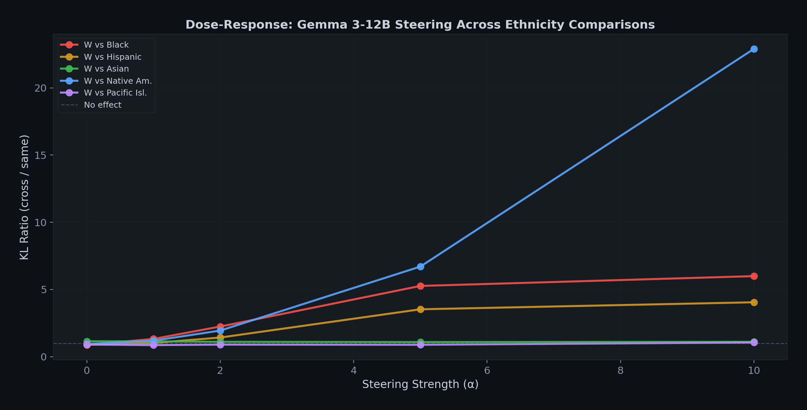

Gemma 12B dose-response at strength=10:

```
Steering Amplification — Gemma 12B (strength=10)
================================================================
Comparison        Baseline Ratio    Amplified Ratio
----------------------------------------------------------------
W vs Black              0.87x           5.99x
W vs Hispanic           0.88x           4.05x
W vs Asian              1.15x           1.11x
W vs Nat. Am.           0.94x          22.90x
W vs Pac. Isl.          0.90x           1.05x
================================================================
```

White vs Native American shows the strongest amplification effect: from 0.94x to 22.90x. White vs Black reaches 5.99x. These confirm the ethnicity direction is causally linked to output distributions — amplifying it dramatically increases cross-ethnicity output divergence.

White vs Asian and White vs Pacific Islander show minimal amplification (1.11x and 1.05x at strength=10), suggesting the ethnicity information for these comparisons may be distributed across multiple directions rather than concentrated in a single probe-recoverable direction.

---

## Gender Confound Check

If our ethnic name lists are imbalanced by gender (more female Black names than female White names, for instance), an "ethnicity" probe might actually be detecting gender. We validate this by running the ethnicity probe on same-gender subsets only.

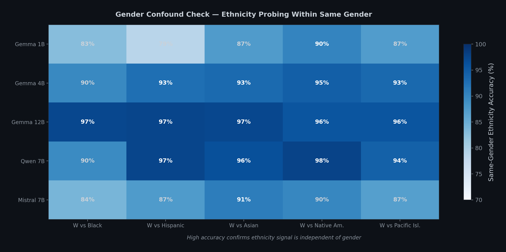

```
Gender Confound — Same-Gender Ethnicity Accuracy (avg of male-only + female-only)
================================================================================
Model         W vs Black  W vs Hisp.  W vs Asian  W vs Nat.Am.  W vs Pac.Isl.
--------------------------------------------------------------------------------
Gemma 1B         83%         79%         87%         90%           87%
Gemma 4B         90%         93%         93%         95%           93%
Gemma 12B        97%         97%         97%         96%           96%
Qwen 7B          90%         97%         96%         98%           94%
Mistral 7B       84%         87%         91%         90%           87%
================================================================================
```

Same-gender-only probing accuracy ranges from 79% to 98%. For Gemma 12B, same-gender accuracy is 96–97% across all five comparisons — confirming the signal is overwhelmingly ethnicity, not gender. Even the lowest value (79%, Gemma 1B White vs Hispanic) far exceeds the 50% chance baseline.

The gender probe accuracy on ethnicity data is also reported: it ranges from 66.5% to 99.5% depending on model and comparison. This is expected — our ethnic name lists carry gender signal because they are gender-balanced with gendered names (Lakisha is female, Jamal is male). The critical finding is that controlling for gender still leaves a strong ethnicity signal.

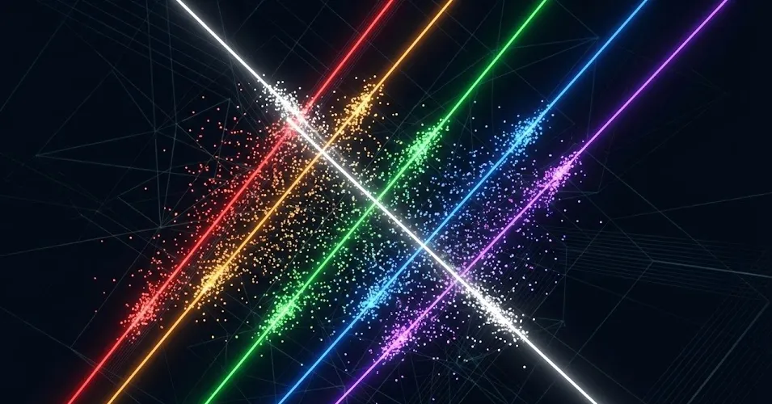

---

## Ambiguous Name Control

What happens with ethnicity-neutral names? We tested 25 ambiguous names (Alex, Jordan, Taylor, etc.) against the ethnicity probe trained on ethnic names.

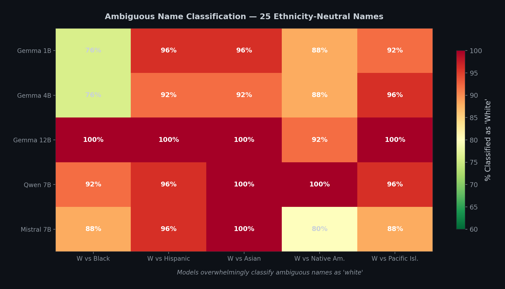

```
Ambiguous Names — % Classified as 'White'
================================================================================
Model         W vs Black  W vs Hisp.  W vs Asian  W vs Nat.Am.  W vs Pac.Isl.
--------------------------------------------------------------------------------
Gemma 1B         76%         96%         96%         88%           92%
Gemma 4B         76%         92%         92%         88%           96%
Gemma 12B       100%        100%        100%         92%          100%
Qwen 7B          92%         96%        100%        100%           96%
Mistral 7B       88%         96%        100%         80%           88%
================================================================================
```

Models overwhelmingly classify ambiguous names as White. For Gemma 12B, it's 92–100% across all comparisons. This reveals a **default assumption**: when the model encounters a name that doesn't strongly signal a non-White ethnicity, it defaults to treating the user as White.

This is not surprising given training data distributions — English-language internet text disproportionately features White-associated names — but it's a concrete example of how statistical defaults in training become implicit profiling in inference.

White vs Black shows the most ambiguity (76% for Gemma 1B and 4B), consistent with some ambiguous names (Jordan, Sage, Pat) having cross-racial usage. Larger models resolve more ambiguity toward White — Gemma 12B classifies all 25 ambiguous names as White in four of five comparisons.

---

## Cross-Model Summary

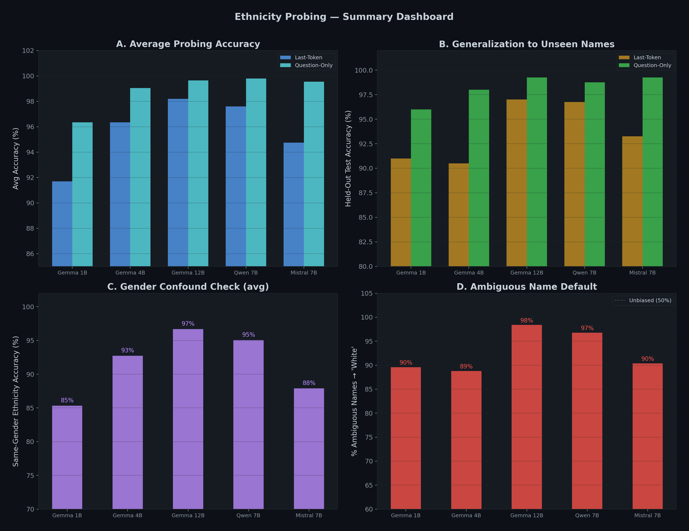

```
Cross-Family Ethnicity Probing — Complete Results (averaged across 5 comparisons)
================================================================================
                    Gemma 1B   Gemma 4B   Gemma 12B  Qwen 7B    Mistral 7B
--------------------------------------------------------------------------------
DATASET
  Prompts/comparison   400        400        400        400        400

VARIANT A: LAST-TOKEN PROBING
  Embedding acc       50.0%      50.0%      50.0%      50.0%      50.0%
  Avg accuracy        91.7%      95.7%      98.2%      97.2%      94.8%
  p-value (all)      0.0000     0.0000     0.0000     0.0000     0.0000

VARIANT B: QUESTION-ONLY PROBING
  Avg accuracy        96.4%      99.1%      99.7%      99.8%      99.5%

VARIANT C: HELD-OUT GENERALIZATION
  LT test (avg)       91.0%      90.5%      97.0%      96.8%      93.2%
  QO test (avg)       96.0%      98.0%      99.2%      98.8%      99.2%

GENDER CONFOUND CHECK
  Same-gender (avg)    85%        93%        97%        95%        88%

AMBIGUOUS NAMES
  % → White (avg)      90%        89%        98%        97%        90%
================================================================================
```

### What Is Consistent Across All Models

1. **The effect is universal.** All five models encode perceived ethnicity for all five EEOC comparisons. 25 out of 25 experiments show statistically significant probing accuracy (p = 0.0000).
2. **Embedding accuracy is exactly chance.** 50.0% for every model in every experiment. The methodology is clean.
3. **Question-only probing is stronger than last-token.** For every model and comparison, question-only accuracy equals or exceeds last-token accuracy.
4. **Held-out generalization is strong.** The probe learns abstract ethnicity directions, not name-specific features.
5. **Gender confound is minimal.** Same-gender probing confirms the signal is ethnicity, not gender leaking through.
6. **Ambiguous names default to White.** 76–100% across all experiments.

### What Varies

1. **Scale increases the effect within Gemma.** Average last-token accuracy: 91.7% (1B) → 95.7% (4B) → 98.2% (12B).
2. **White vs Black is the hardest comparison.** Lowest accuracy for 4 of 5 models. This may reflect greater cultural integration of Black-associated names into mainstream English, making them less "foreign" to the model.
3. **Steering effects are weaker for ethnicity than gender.** Baseline ratios are lower and more variable. The ethnicity direction may be less concentrated in a single linear direction than gender.
4. **Best probing layer varies by architecture.** Gemma 1B/4B peak at L2 (very early), Gemma 12B at L47-48 (very late), Qwen at L6-28, Mistral at L16-18.

---

## Limitations

### What We Can Claim

- Five models across three families encode perceived ethnicity from names (86–99% accuracy, 25/25 experiments)
- The encoding generalizes to unseen names (80–100% held-out test accuracy)
- The encoding propagates beyond name tokens into shared representations (94.8–100% question-only)
- The encoding is not a gender confound (79–98% same-gender accuracy)
- Ambiguous names are overwhelmingly classified as White (76–100%)
- The ethnicity direction is causally linked to output divergence for some comparisons (up to 22.9x amplification ratio)
- All embedding baselines are exactly 50% (chance) — the methodology is sound

### What We Cannot Claim

- **Harmful output differences.** We measured hidden-state encoding and KL divergence on logit distributions, not the quality or fairness of generated text. High probing accuracy does not necessarily mean harmful bias in practice.
- **That names perfectly signal ethnicity.** Many names are shared across racial groups. "Jasmine" appears in our Black name list but is used across ethnicities. We test perceived ethnic association, not actual identity.
- **That the EEOC categories are natural or comprehensive.** These are administrative categories with specific political and historical origins. They collapse enormous within-group diversity (e.g., "Asian" spans East Asian, South Asian, and Southeast Asian identities).
- **RLHF specificity.** Without base model comparisons, we cannot determine whether ethnicity encoding is introduced by instruction tuning or inherited from pretraining.
- **That weaker steering = weaker encoding.** Low baseline ratios for Gemma 12B on some comparisons don't mean the model doesn't encode ethnicity — probing accuracy is 97.5–99.0%. The ethnicity signal may be distributed across multiple directions that a single linear probe captures for classification but that don't align with a single ablation axis.

### Specific Technical Limitations

- **Name validity for Native American and Pacific Islander groups.** Many Native Americans and Pacific Islanders use anglicized English names. Our name lists draw from traditional naming conventions, which may overestimate the real-world ethnicity signal these names carry. However, the probing accuracy itself (93.8–97.7%) reveals how strongly the models associate these names with non-White identity.
- **White as universal reference group.** We test all comparisons against White. We do not test Black vs Hispanic, Asian vs Native American, etc. The choice follows audit study convention but does not capture all pairwise interactions.
- **200 questions × 45 names** is larger than most probing studies but still limited for production auditing.
- **English-centric.** All names and questions in English. Ethnicity encoding may differ in other languages.
- **Temperature=0.** All probing at deterministic inference. Higher temperatures may alter results.

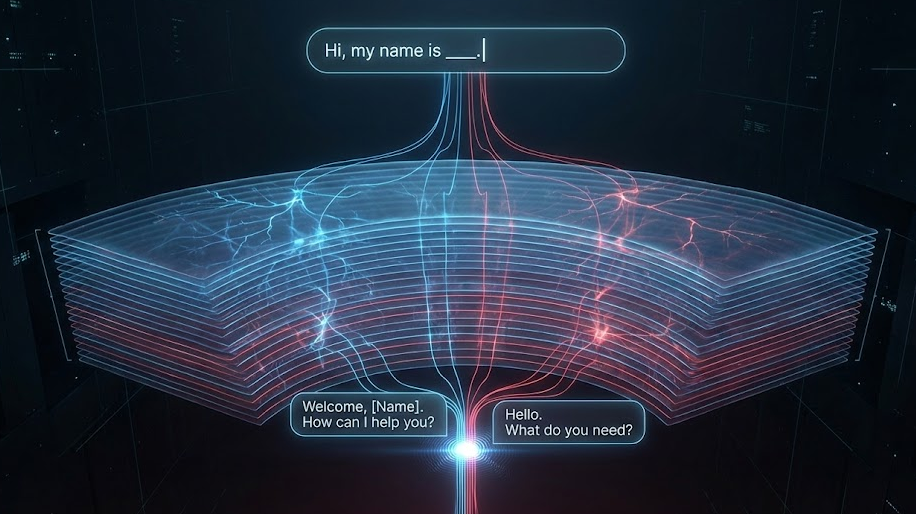

---

## What This Means

### The Pattern Holds

In Part II, we established: language models silently encode user gender from names, propagate it into shared representations, and use it to influence outputs — while chain-of-thought monitoring catches nothing.

Part III shows the same mechanism operates on ethnicity. The same models, the same architecture families, the same 200 questions — with different names signaling race instead of gender — produce 86–99% probing accuracy across 25 separate experiments.

Implicit user modeling is not limited to gender. It is a general mechanism that operates on any demographic signal a name provides.

### What This Means for Deployed Systems

When an LLM is deployed as a career coach, financial advisor, health assistant, or college counselor, it doesn't just process the user's question. It first builds an internal demographic profile — gender from Part II, ethnicity from Part III — from the user's name alone.

This profile:
- Is invisible to the user (they don't know the model has classified them)
- Is invisible to chain-of-thought monitoring (Part II showed 0/80 explicit gender reasoning)
- Is invisible to output auditing unless you specifically test paired prompts
- Causally influences the response distribution

The relevant legal frameworks:
- **Title VII** (employment discrimination) — applies when LLMs are used for hiring, career coaching, or workplace recommendations
- **Fair Housing Act** — applies when LLMs provide housing-related advice
- **Equal Credit Opportunity Act** — applies when LLMs provide financial recommendations
- **Civil Rights Act** — applies broadly to discrimination in services

The challenge: none of these frameworks were designed for demographic profiling that happens in activation space rather than in explicit decision logic.

### The Default-to-White Finding

The ambiguous name result — 76–100% classified as White — is worth highlighting separately. When a model encounters a name that doesn't strongly signal a non-White ethnicity, it defaults to a White frame.

This means the model's "neutral" state is not actually neutral. Its default assumption is a White user. Non-White users must carry a sufficiently strong ethnic signal in their name to override this default.

This is consistent with the training data distribution (English-language internet text skews White) but has concrete implications for fairness: users with ambiguous names receive "White-default" responses, while users with strongly ethnic names receive ethnicity-adapted responses. Neither group is explicitly asked about their ethnicity.

---

## What's Next

1. **Part IV: Age and socioeconomic status.** Names carry generational signal (Gertrude vs Madison) and class signal (names associated with different educational attainment). Does the same mechanism apply?

2. **Cross-attribute interactions.** What happens when the model infers gender *and* ethnicity *and* age simultaneously? Are the encoding directions orthogonal or correlated? Does "Lakisha" (Black + female) get different advice than "Emily" (White + female) on the same question — and is the difference attributable to ethnicity, gender, or both?

3. **IT vs PT model comparison.** Comparing instruction-tuned and pretrained models to determine whether demographic encoding is introduced by RLHF or inherited from pretraining.

4. **Full mechanistic experiments for ethnicity.** Circuit tracing and SAE analysis on ethnicity directions, following the gender mechanistic pipeline from Part II. Do the same attention heads propagate both signals?

---

## Try It Yourself

The complete code is available in our research repository.

**GPU extraction (requires CUDA GPU):**
```bash
git clone https://github.com/canivel/ai-safety.git
cd ai-safety/research-idea-6/experiments/ethnicity

# Extract hidden states for one model + one comparison (~10 min on A40)
python extract_hidden_states_eth.py gemma4b white_vs_black

# Run all 5 comparisons for one model
for comp in white_vs_black white_vs_hispanic white_vs_asian white_vs_native_american white_vs_pacific_islander; do
  python extract_hidden_states_eth.py gemma4b $comp
done
```

**CPU analysis (runs locally):**
```bash
python analyze_probing_eth.py gemma4b white_vs_black
```

---

## Conclusion

We asked: does a language model treat users differently based on perceived ethnicity?

The answer, across five models, three architecture families, and five EEOC race/ethnicity categories:

**What the data shows:**
- Ethnicity probing accuracy ranges from 86.2% to 99.0% across 25 separate experiments (50% embedding baseline, p = 0.0000 for all)
- The ethnicity signal propagates beyond name tokens into shared question representations (94.8–100% question-only accuracy)
- The probe generalizes to completely unseen names (80–100% held-out accuracy)
- The signal is ethnicity, not gender leaking through (79–98% same-gender accuracy after controlling for gender)
- Ambiguous names default to White (76–100%)
- The ethnicity direction is causally linked to output distributions for some comparisons (up to 22.9x amplification ratio)

**How ethnicity compares to gender:**
- Probing accuracy is of comparable magnitude (86–99% ethnicity vs 88–100% gender)
- Question-only propagation is comparably strong (94.8–100% vs 99.8–100%)
- Held-out generalization is slightly lower for White vs Black (80–96.2% vs 83.8–98.8%) but comparable for other comparisons
- Steering baseline ratios are generally lower for ethnicity, suggesting the signal may be more distributed across directions

**The pattern from Part II generalizes:** implicit user modeling is not a gender-specific phenomenon. It operates on any demographic signal present in a name. The same models that profile by gender also profile by ethnicity — silently, invisibly, and at every layer of the network.

---

## References

1. Bertrand, M. & Mullainathan, S. (2004). "Are Emily and Greg More Employable Than Lakisha and Jamal? A Field Experiment on Labor Market Discrimination." *American Economic Review, 94(4).* [aeaweb.org/articles?id=10.1257/0002828042002561](https://www.aeaweb.org/articles?id=10.1257/0002828042002561)
2. Fryer, R. & Levitt, S. (2004). "The Causes and Consequences of Distinctively Black Names." *Quarterly Journal of Economics, 119(3).* [doi.org/10.1162/0033553041502180](https://doi.org/10.1162/0033553041502180)
3. Chetty, R., Hendren, N., Jones, M., & Porter, S. (2018). "Race and Economic Opportunity in the United States: An Intergenerational Perspective." *NBER Working Paper 24441.* [nber.org/papers/w24441](https://www.nber.org/papers/w24441)
4. Gaddis, S.M. (2017). "How Black Are Lakisha and Jamal? Racial Perceptions from Names Used in Correspondence Audit Studies." *Sociological Science, 4.* [sociologicalscience.com/articles-v4-19-469](https://sociologicalscience.com/articles-v4-19-469/)
5. Chen, Y., et al. (2025). "What Kind of User Are You? Uncovering User Models in LLM Chatbots." *ICML 2025.* [openreview.net/forum?id=si1XJoQeaO](https://openreview.net/forum?id=si1XJoQeaO)
6. Tonneau, M., et al. (2026). "Demographic Probing of Large Language Models Lacks Construct Validity." *arXiv:2601.18486.* [arxiv.org/abs/2601.18486](https://arxiv.org/abs/2601.18486)
7. Bolukbasi, T., et al. (2016). "Man is to Computer Programmer as Woman is to Homemaker? Debiasing Word Embeddings." *NeurIPS 2016.* [arxiv.org/abs/1607.06520](https://arxiv.org/abs/1607.06520)
8. Belinkov, Y. (2022). "Probing Classifiers: Promises, Shortcomings, and Advances." *Computational Linguistics, 48(1).* [aclanthology.org/2022.cl-1.7](https://aclanthology.org/2022.cl-1.7/)
9. Elhage, N., et al. (2022). "Toy Models of Superposition." *Anthropic / Transformer Circuits.* [transformer-circuits.pub/2022/toy_model](https://transformer-circuits.pub/2022/toy_model/)

---

*The complete code, data, and results are available at [github.com/canivel/ai-safety](https://github.com/canivel/ai-safety).*
